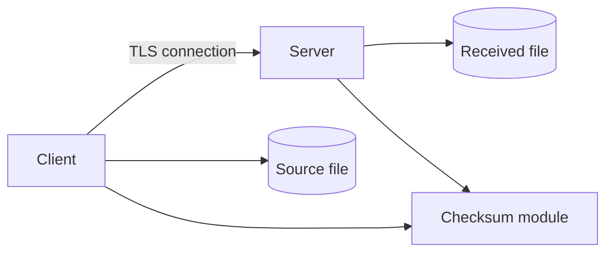
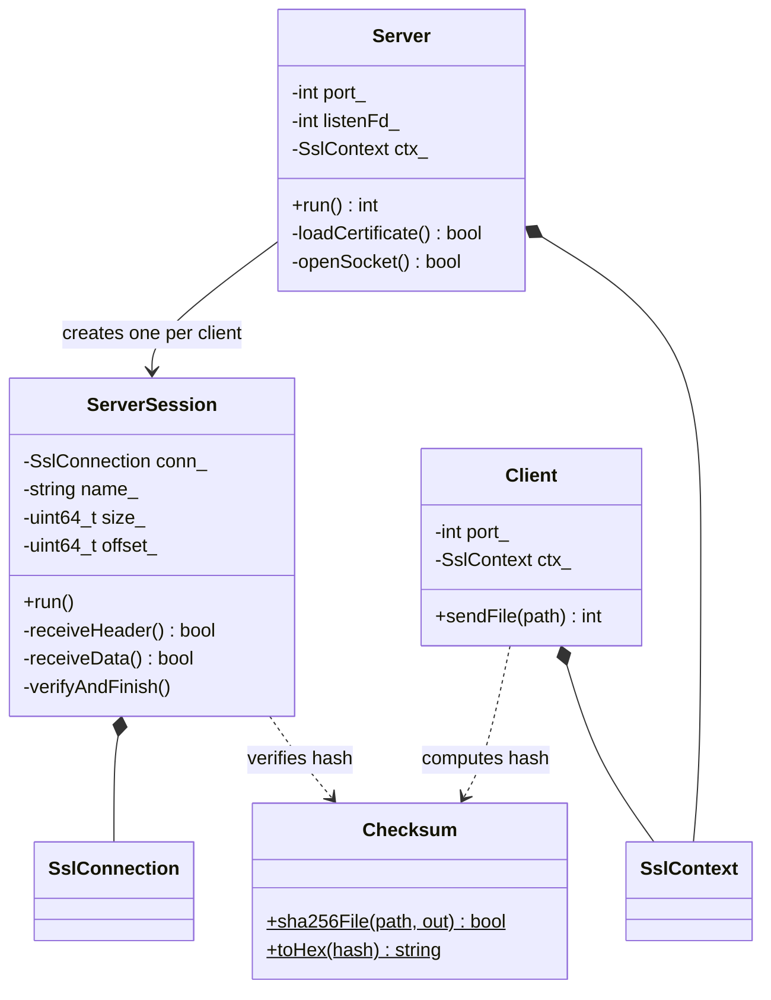
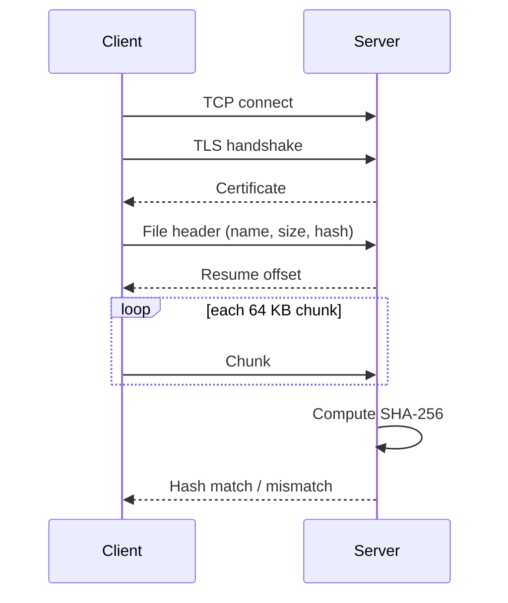
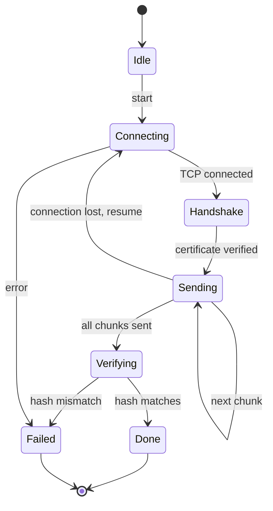

# System Architecture

## 1. Overview
A client-server system. The client reads a file and sends it in chunks over a TLS connection. The server stores it and checks its SHA-256 hash.

## 2. Components and Responsibilities
| Component | Responsibility |
|---|---|
| Server | Listens on a port, accepts clients, starts a session |
| ServerSession | Handles one client: TLS handshake, receives chunks, verifies hash |
| Client | Connects, verifies certificate, sends file in chunks |
| Checksum | Computes SHA-256 of a file |
| io.h | Helpers that send and read exact byte counts over TLS; the message layout is in docs/PROTOCOL.md |
| raii.h | SslContext and SslConnection classes that free TLS objects and close sockets automatically |

## 3. Data Structures
- Header fields, sent in this order: name length (uint64_t), file name (std::string), file size (uint64_t), SHA-256 (Checksum::Hash, a std::array<unsigned char, 32>).
- Resume offset (uint64_t) sent back by the server.
- Chunk buffer: std::vector<char> of 64 KB.
- SslContext and SslConnection (raii.h): own the OpenSSL objects and free them automatically.

## 4. Class Diagram

## 5. Sequence Diagram

## 6. State Machine Diagram (Client)

## 7. Implementation Plan
1. TLS server and client connect.
2. Send a file in chunks.
3. Add SHA-256 check.
4. Add resume.
5. Tests and documentation.

## 8. Development Environment
Ubuntu (WSL), g++ (C++20), CMake, OpenSSL, Git and GitHub.

## 9. Branching Strategy
main holds stable work. Each stage is developed on a branch (stage3-design, stage4-prototype, ...) and merged into main when complete.
