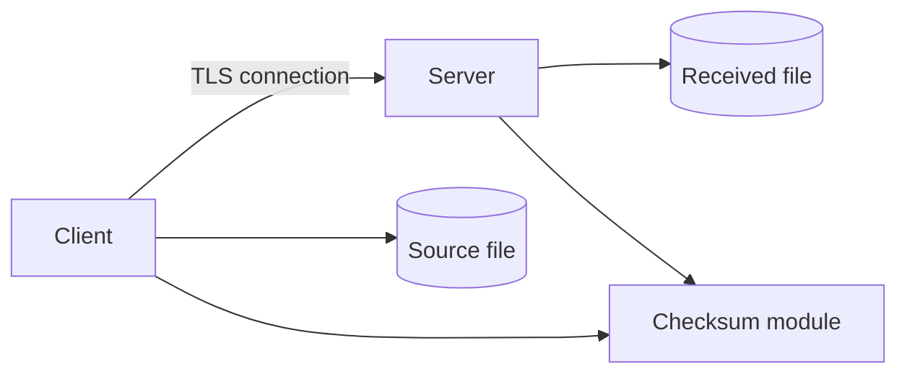
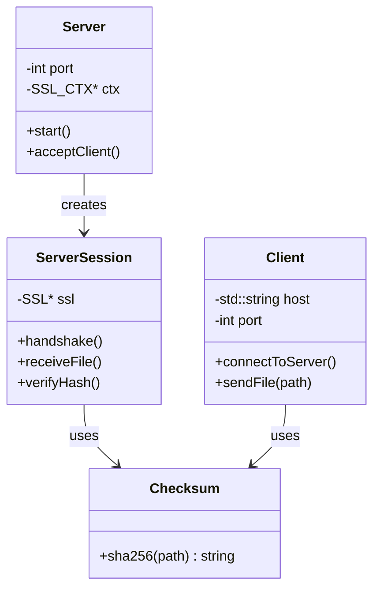
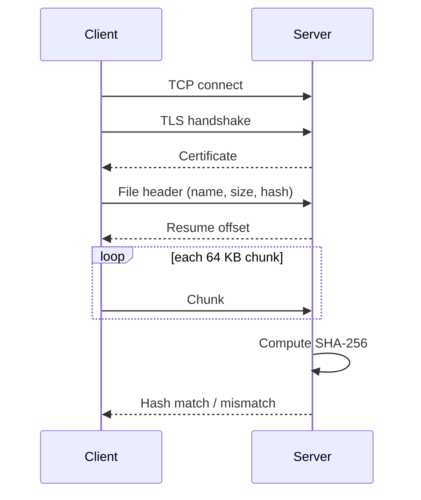
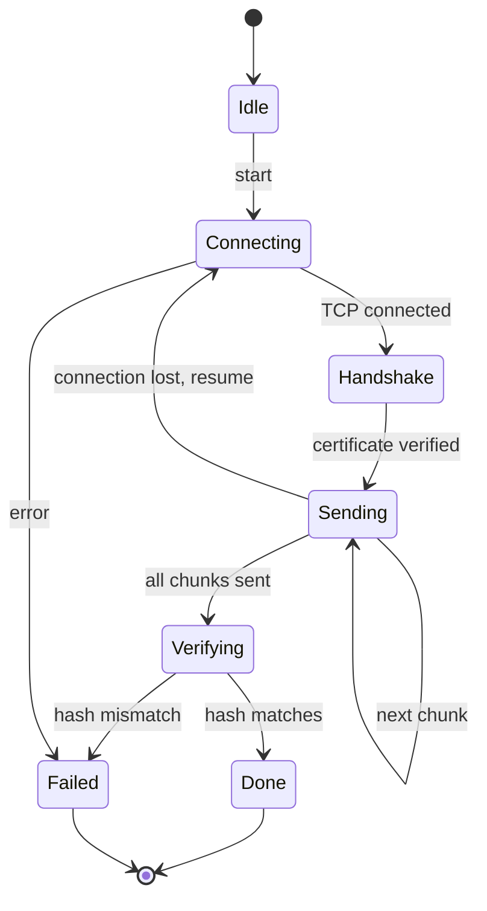

# System Architecture

## 1. Overview
A client-server system. The client reads a file and sends it in chunks over a TLS connection. The server stores it and checks its SHA-256 hash.

## 2. Components and Responsibilities
| Component | Responsibility |
|---|---|
| Server | Listens on a port, accepts clients, starts a session |
| ServerSession | Handles one client: TLS handshake, receives chunks, verifies hash |
| Client | Connects, verifies certificate, sends file in chunks |
| Checksum | Computes SHA-256 of a file |
| Protocol | Defines the messages exchanged (header, chunk, hash, result) |

## 3. Data Structures
- FileHeader { std::string name; uint64_t size; uint64_t resumeOffset; }
- Chunk as a std::vector<char> of fixed size (64 KB)
- Hash as a 64-character hex std::string

## 4. Class Diagram

## 5. Sequence Diagram

## 6. State Machine Diagram (Client)

## 7. Implementation Plan
1. TLS server and client connect.
2. Send a file in chunks.
3. Add SHA-256 check.
4. Add resume.
5. Tests and documentation.

## 8. Development Environment
Ubuntu (WSL), g++ (C++20), CMake, OpenSSL, Git and GitHub.

## 9. Branching Strategy
main holds stable work. Each stage is developed on a branch (stage3-design, stage4-prototype, ...) and merged into main when complete.
